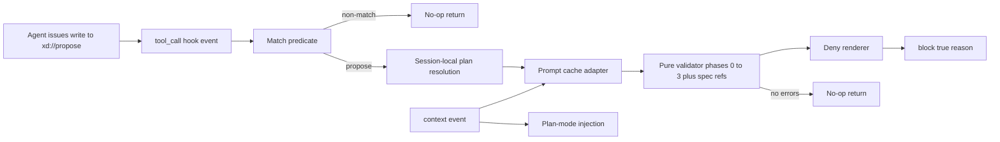

# Design

## Context

Native OMP v17.3.7 validates plan approval mechanically only for file existence and title normalization (`preparePlanForReview`); content quality is prompt-only. The upstream `dev-pomogator` plan gate proves the missing layer as a phased deterministic validator. This design ports that layer onto pinned OMP extension surfaces without Claude hooks, without the upstream daemon/registry dispatch, and without any external dependency, per `MIGRATION_MATRIX.md` DROP decisions and the repository single-plugin boundary.

## Component boundary

### Planned layout under repository-root `src/gate/`

Sources follow the house build convention (`docs/omp-v17.3.7-contract.md`, `scripts/build-plugin.mjs`): plain JavaScript with JSDoc types at the repository root, copied by the build script into the child `dist/`; the child package tree itself never holds gate sources.

- `match.js` — pure predicate over `toolName` + write target; no I/O.
- `resolve.js` — session identity + slug normalization + session-local plan path; containment checks.
- `cache.js` — prompt cache read/write adapter (session-local directory only).
- `validator/index.js` — pure phased validator entry (`validatePlan(input): PlanValidationResult`).
- `validator/structure.js` — sections, order, human summary, inventory subsections, requirements subsections, todos, verification, file changes, impact analysis (phase 1).
- `validator/duplicate.js` — SHA-256 duplicate scan with size short-circuit (phase 0).
- `validator/grounding.js` — relevance window + score (phases 2/2.5).
- `validator/crossref.js` — file-change body mentions (phase 3).
- `validator/specref.js` — guarded detection + qualified reference extraction + disk existence checks (FR-9).
- `deny.js` — bounded reason rendering and truncation policy.
- `inject.js` — context-event injection builder.
- `diagnostics.js` — bounded session-local diagnostic ring.
- `resources/plan-template.md` — bundled template with hash inventory.
- `resources/section-model.json` — bundled skeleton/subsection/action model with hash inventory.

The pure validator receives plan text, cache entries, project root handle, and limits only; it never imports OMP, reads a clock directly, or writes. OMP-facing glue (event subscription, result translation, fault wrapping) lives in the extension adapter and is the only code allowed to touch hook APIs.

## Matching and resolution algorithm

1. `tool_call` arrives: if `toolName !== "write"`, return.
2. Inspect the write target string; match only the `xd://propose` device (native predicate semantics per `src/tools/resolve.ts` `isProposeToolCall`). Non-match returns before any I/O.
3. Read session identity from the runner; compute the session-local plan directory per the `local://` root contract (probe-verified name transformation).
4. The propose write CONTENT is the plan's `<slug>` title; expected file `<slug>-plan.md` in that directory (the model already wrote the plan body to `local://<slug>-plan.md` earlier). Absent/over-budget → allow + diagnostic.
5. Read plan bytes within budget; wrap the whole handler in one fault barrier translating every exception to allow + diagnostic.

Probe obligations (TASK-1): confirm model-issued propose writes emit `tool_call` with the title in `content`; confirm nested device dispatches do not emit; record the session-identity-to-directory-name transformation.

## Validation pipeline

Phases run in fixed order; a phase failure is a fault (allow), a phase error is a finding.

- **Phase 0 duplicate:** SHA-256 of plan bytes; sibling `*-plan.md` scan with ±10-byte size gate; hash equality blocks.
- **Phase 1 structure:** ten mandatory sections in order; non-empty human summary; Existing-Spec Inventory four subsections; Requirements FR/EARS-AC/NFR/Assumptions; Todos block grammar; Verification Plan commands; File Changes table (relative paths, closed action set, non-empty Reason); Impact Analysis on destructive actions. One bounded error per violation with line and hint.
- **Phase 2 extracted requirements:** Context `Extracted Requirements` block with ≥2 numbered items.
- **Phase 2.5 grounding:** deterministic relevance of plan against cached prompt window; deny at/below threshold with window excerpt.
- **Phase 3 cross-reference:** File Changes paths mentioned in body; unmentioned ratio > 0.5 blocks with first five paths.
- **Spec-reference phase:** guarded/spec touch detection → qualified reference extraction → slug directory + canonical heading existence on disk; containment-checked reads; blocks on missing/absent.

Advisory phase (anti-generic, detail floors, evidence tags, test-spec-sync, bugfix-BDD) is parsed and recorded to diagnostics only; it never blocks in this release.

## Deny rendering

Reason = concatenation of: (1) one `line N: message` + `💡 hint` per blocking error ordered by phase/line/code; (2) template excerpt ≤8 KiB; (3) last five prompt excerpts; total ≤16 KiB with explicit `…[truncated]` marker; truncation drops prompt excerpts first, then template, never error entries.

## Injection model

`context` handler: if plan mode is active (probe-determined signal), append exactly one message ≤2 KiB: skeleton names in order, spec-reference obligation sentence, template pointer. Deep-copy-only mutation; idempotent per event; failure is a non-fatal skip with diagnostic.

## Fault policy

One wrapping catch around the handler. Fault classes per FR-2 are closed. Each fault appends `{code, message ≤1024 chars, sessionRelativePath?, at}` to a ring buffer (≤100 records/256 KiB) inside the session-local directory. The invariant "block only after complete successful validation with errors" is asserted by the fault-injection suite.

## DEC-1: In-process validator, no daemon port

**Rationale:** The upstream gate dispatches through an authenticated loopback daemon and registry; those are Claude-harness machinery dropped by `MIGRATION_MATRIX.md`, and a daemon violates the dependency-absent single-artifact rule.

**Trade-off:** Validation logic must be bundled into the child artifact rather than shared with the upstream checkout.

**Alternatives:** Port the daemon (rejected: network/credential/process surface); shell out to upstream CLI (rejected: source-checkout dependency).

## DEC-2: Fail-open implemented as code, not policy

**Rationale:** OMP blocks on hook errors by default; there is no policy knob. The only honest port of upstream fail-open is a fault barrier that never throws.

**Trade-off:** A crashed gate is silent except for diagnostics; diagnostic ring + adversarial review compensate.

**Alternatives:** Let faults block (rejected: inverts upstream doctrine, wedges sessions); try to reconfigure the wrapper (rejected: no such surface).

## DEC-3: Self-owned prompt cache from context events

**Rationale:** Grounding needs prompts before approval; `session_stop` transcripts arrive after; OMP `context` events expose outgoing message copies cheaply.

**Trade-off:** Cache fidelity depends on `context` semantics (TASK-1 probe); user messages delivered only through exotic paths may be missed — degrade-open covers it.

**Alternatives:** Parse session JSONL on demand (rejected: format coupling + cost at approval time); skip grounding (rejected: loses the anti-copypaste phase).

## DEC-4: Disk-checked spec references without the kernel

**Rationale:** The gate must be usable before/without v0.2 kernel; slug directory + canonical heading scan is sufficient and auditable.

**Trade-off:** No edge-level semantics (covers/tested-by) until a kernel exists.

**Alternatives:** Depend on spec-kernel v0.2 (rejected: couples releases); skip reference existence checks (rejected: fabricated references would pass).

## DEC-5: Keep upstream thresholds and section set as research inputs

**Rationale:** The ten-section skeleton, 0.5 cross-reference threshold, ±10-byte size gate, relevance deny threshold, rolling-10/2h cache, and deny format are battle-tested in the upstream harness.

**Trade-off:** Target corpora may eventually need tuned values; changes require fixture evidence.

**Alternatives:** Redesign thresholds from scratch (rejected: untested); copy upstream file verbatim (rejected: license/provenance gate + harness coupling).

## DEC-6: Release-stage separation from read-only releases

**Rationale:** The gate blocks user actions; it belongs to the authoring/mutation stage class with its own safety gates, not to v0.1/v0.2/v0.3.

**Trade-off:** Later availability.

**Alternatives:** Ship alongside v0.2 (rejected: mixes read-only evidence profile with a blocking capability).

## No runtime mutation design

The gate never edits plans, specs, or repository files. The only writes are session-local cache/diagnostic state inside the OMP temp directory. Plan repair remains the agent's job, guided by the deny reason.
