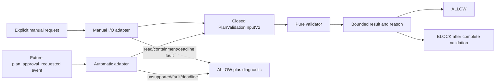

# Design

## Context

Pinned OMP v17.3.7 resolves a plan natively before approval but exposes no extension event carrying that selected plan. A pre-write hook sees only the title and runs before native title/state/newest-plan fallback selection; reconstructing the selected file from temp paths would duplicate host logic incorrectly. Therefore `plan-gate@2` has two explicit profiles:

- `plan-gate-manual@1` — implementable now; validates one exact caller-supplied plan request.
- `plan-gate-automatic@1` — `DEFERRED_HOST_ABI`; requires the future post-resolver event in `docs/omp-plan-approval-event-contract.md`.

The deterministic validation core is shared. Neither profile uses Claude hooks, the upstream daemon/registry, guessed temp roots, or an additional agent-facing tool surface.

## Component boundary

Host owns selection and transition copying. The automatic event arrives after `resolveApprovedPlan`, carrying selected content plus selection/approval session IDs, transition kind, and copied-plan hash. The adapter checks the complete identity one-to-one and performs no fallback scan.

## Planned root-source layout

Sources follow the repository build convention: root JavaScript with JSDoc types is copied/bundled by `scripts/build-plugin.mjs` into the single child package's `dist/`; `plugins/omp-spec-kit/src/**` is not a supported source tree.

- `src/gate/manual-adapter.js` — explicit request admission and I/O construction.
- `src/gate/automatic-adapter.js` — future `selected-plan-event@1` translation; gated by host pin.
- `src/gate/io-resolver.js` — bounded explicit reads and realpath/reparse/symlink containment for manual mode.
- `src/gate/validator/index.js` — pure `validatePlan(input)` entry.
- `src/gate/validator/identity.js` — schema/hash/mode/host-contract checks.
- `src/gate/validator/duplicate.js` — explicit-candidate duplicate checks.
- `src/gate/validator/structure.js` — section/form checks.
- `src/gate/validator/grounding.js` — deterministic prompt relevance.
- `src/gate/validator/crossref.js` — File Changes/body consistency.
- `src/gate/validator/specref.js` — qualified references against a complete supplied index.
- `src/gate/deny.js` — paged findings and bounded host reason.
- `src/gate/resources/{plan-template.md,section-model.json,guarded-paths.json}` — exact hash-inventoried resources; guarded policy has only `.specs/**`, `MIGRATION_MATRIX.md`, `ROADMAP.md`, and `docs/decisions/**`.
- `src/gate/release.js` — closed manual/automatic release-profile evaluator.

The pure validator imports no OMP, filesystem, clock, network, process, or MCP API. Only adapters perform I/O. Every adapter exit either supplies a complete valid input to the validator or returns ALLOW with exactly one bounded bridge diagnostic.

## Manual admission

1. Receive `ManualPlanValidationRequestV1` containing exact plan URL/content/hash/title/slug, explicit duplicate candidate URLs, prompt excerpts, project root, and limits.
2. Verify plan bytes and hash before any validation.
3. Resolve only the declared duplicate candidate URLs. Maximum 20 candidates and 8 MiB aggregate bytes. An unreadable candidate is not silently skipped: the adapter returns `DUPLICATE_INPUT_UNAVAILABLE` so validation cannot prove non-duplication from a partial set.
4. Load the exact hash-inventoried resource set and build a complete `SpecReferenceIndexV2` only when `.specs/**` or one of the three other guarded patterns is touched; apply containment and 512 KiB/2 MiB budgets.
5. Supply one closed `PlanValidationInputV2` with SAME_SESSION binding. No directory scan, temp-root inference, or fallback reconstruction occurs.

Manual output is advisory unless a caller explicitly adopts the decision. This profile does not claim automatic plan interception.

## Automatic admission

The future host emits `plan_approval_requested` after native resolution and before approval. It carries request ID, selection/approval session IDs, transition kind/copied-plan hash, planMode, selected URL/content/hash, supplied title and normalized slug. The adapter:

1. refuses a pin without `selected-plan-event@1`;
2. validates the ID/kind/copied-hash relation and selected plan identity;
3. maps the event one-to-one to AUTOMATIC input;
4. returns the exact host result before the outer timeout.

It does not subscribe to model-issued `write` calls as a substitute. OMP v17.3.7 therefore remains `DEFERRED_HOST_ABI` for automatic mode.

## Validation pipeline

Phases run in fixed order. A validation error is a finding; an internal failure is a bridge fault and returns ALLOW.

1. **IDENTITY:** closed schema, all hashes, transition binding, mode/host pair, complete index/resources, and limits.
2. **DUPLICATE:** SHA-256 against explicit bounded candidates, with ±10-byte size short-circuit.
3. **STRUCTURE:** ten mandatory sections, ordered/non-empty forms, inventory/requirements/todo/verification/file-change/impact obligations.
4. **GROUNDING:** deterministic lexical relevance against explicit prompt excerpts; exact deny threshold `-20`.
5. **CROSS_REFERENCE:** File Changes paths mentioned outside the table; block above 0.5 unmentioned ratio.
6. **SPEC_REFERENCE:** required qualified IDs exist in the complete supplied index.
7. **ACTIONABILITY:** diagnostics only; never participates in BLOCK.

## Deadline and fault policy

The adapter installs one internal deadline no greater than 20 seconds. All loops and I/O observe the remaining budget. Validator exception, resource failure, unreadable input, containment refusal, partial index, or internal deadline expiry returns ALLOW plus one bounded diagnostic. The handler must return before the pinned host's default 30-second outer timeout; an outer timeout/error is host fail-closed and an implementation defect.

Invariant: only a complete successful validation returning one or more ERROR findings may produce BLOCK.

## Deny rendering

The structured result carries total counts and cursor-paged complete findings. The host reason is at most 16 KiB: complete error+hint rows first, then exact omitted count/cursor, then template/prompt excerpts in remaining space. Truncation never cuts a finding row or claims completeness.

## Release profiles

`plan-gate-manual@1` requires the exact manual check-ID set in the schema, including explicit identity, manual guidance, dependency-absent execution, unreadable/containment/resource fail-open variants, budgets, fixtures and adversarial review.

`plan-gate-automatic@1` requires that entire set plus the separately identified automatic transition, context, installed-event and host-ABI checks. `PlanGateEligibilityResultV2` returns candidate-bound eligibility, capability state and closed blockers; a manual candidate cannot be relabeled automatic.

## Decisions

### DEC-1: Host-selected plan, never reconstructed selection

**Rationale:** Native resolution includes state/title/newest-plan fallback and session transitions. A title-only pre-write event cannot identify the final plan.

**Trade-off:** Automatic blocking waits for a host ABI addition.

**Alternatives:** scan temp/session directories or replay native fallback (rejected: divergent selection and containment risk); treat a propose write as approval (rejected: wrong lifecycle point).

### DEC-2: Explicit manual profile remains independently useful

**Rationale:** The validation core can be exercised and consumed with exact caller-supplied bytes today without claiming interception.

**Trade-off:** Manual callers decide how to act on the result.

**Alternatives:** defer the entire validator (rejected: needless coupling); call manual validation automatic (rejected: false runtime claim).

### DEC-3: Adapter I/O, pure validator

**Rationale:** Filesystem containment and unreadable-input handling require I/O; placing them in a pure matcher makes the contract impossible.

**Trade-off:** Adapter fixtures and validator fixtures are separate evidence sets.

**Alternatives:** let the validator read disk (rejected: non-deterministic and untestable purity claim); infer absence from partial reads (rejected: false allow/block evidence).

### DEC-4: Internal fail-open, outer fail-closed acknowledged

**Rationale:** OMP's wrapper fails closed on handler error/timeout. A bounded internal barrier can preserve gate fail-open semantics only if it returns before that boundary.

**Trade-off:** deadline instrumentation is release-critical.

**Alternatives:** 60-second inherited timeout (rejected: exceeds host boundary); claim outer fail-open (rejected: contradicted by pinned source).

### DEC-5: Capability release is independent of historical v0.3

**Rationale:** Plan gating is a post-v0.3 capability, not part of the eight-tool read-only first slice.

**Trade-off:** separate profile receipts and product capability state.

**Alternatives:** reinterpret v0.3 receipts (rejected: destroys historical evidence).

## Repository mutation boundary

The validator never edits plans, specs, or repository files. Manual adapter reads are bounded and contained. Repair remains the caller's responsibility. Any future automatic context message is optional, bounded, and permitted only by a host event carrying `planMode:true`; failure to emit it never changes validation.
