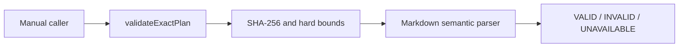

# Design

## Context

OMP already owns plan discovery and approval. This capability begins only when a caller explicitly supplies exact plan bytes. It is an advisory library: the caller decides whether and how to use the result.

## Boundary

`validateExactPlan` is the only product contract. There is no directory reader, extension hook, provider call, registry, secondary authority, or persistent service.

## Processing

1. Validate request shape and hard bounds.
2. Compute SHA-256 over the original UTF-8 content.
3. Compare the optional expected digest.
4. Parse recognized semantic headings while allowing unrelated sections and arbitrary order.
5. Validate objective, approach, file/action rows, verification, assumptions, and destructive impact when triggered.
6. Optionally emit the non-blocking request-alignment warning.
7. Sort complete findings, retain the first 50, and report the exact omitted count.

## Failure semantics

Content defects are `INVALID`. A request that cannot be evaluated truthfully is `UNAVAILABLE`. The implementation catches unexpected exceptions at the public boundary and emits `VALIDATOR_FAILURE`; it never converts inability to evaluate into `VALID`.

## Implementation shape

The root source of truth is one JavaScript module with JSDoc types under `src/gate/validate-exact-plan.js`. The normal build copies it into the installed package. Rules are code constants; there are no runtime templates or inventories to synchronize.

## Decisions

### DEC-1: Exact bytes, not plan discovery

**Rationale:** Native OMP already resolves plans. Explicit bytes make the validator deterministic and independently testable.

**Trade-off:** Callers must obtain content before invoking the library.

### DEC-2: Semantic fields, not a fixed document template

**Rationale:** Objective, approach, files/actions, verification, assumptions, and impact are observable planning outcomes. A fixed heading census rejects otherwise actionable native plans.

**Trade-off:** A closed alias table must be versioned when a genuinely new heading convention is accepted.

### DEC-3: Three truthful statuses

**Rationale:** Content failure and evaluator failure are different facts.

**Trade-off:** Callers must handle `UNAVAILABLE` explicitly.

### DEC-4: Request alignment is advisory

**Rationale:** Deterministic lexical comparison can highlight obvious drift but is not reliable enough to reject a plan.

**Trade-off:** Some unrelated plans may remain structurally valid.

## Mutation boundary

The function reads only its request values and returns data. It does not mutate plans, specifications, repository files, process state, or caller objects.
