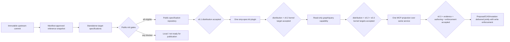

# Product lifecycle design

## Design objective

Create one trustworthy public product whose claims advance only when the corresponding externally observable evidence exists. The product starts with specifications and provenance, not a copied runtime. This document defines authority and lifecycle boundaries; implementation belongs to the owning specifications.

## Product boundary

The arrows are gates, not dates. A later node cannot become delivered while an earlier gate is blocked.

## Authority model

| Concern | Canonical authority | Product use |
|---|---|---|
| Imported bytes and provenance | `IMPORT_MANIFEST.yaml` | Decide whether the freeze is reproducible and which copied bytes are affected by license status. |
| Migration/adoption decisions | `MIGRATION_MATRIX.md` | Explain which upstream ideas are adopted, rewritten, deferred, or dropped. |
| Product/publication lifecycle | `product:FR-1` through `product:FR-9` | Decide public claims, identity, stage, blocker, next gate, and generator-port MCP destination. |
| Marketplace/package/activation/release | Versioned aggregate owned by `plugin-distribution:FR-13`: historical `distribution-release-eligibility@1` for v0.1–v0.3.2 receipts, forward `distribution-release-eligibility@2` for new candidates | Accept or refuse the candidate-applicable distribution result; product/public composition remains here and every result binds its schema/profile and candidate artifact. |
| Read-only kernel/query evolution | `spec-kernel:FR-14` stage-targeted aggregate gate; member contracts remain internal to `spec-kernel` | Bind the current target-stage result to the current candidate. For v0.3/authoring, retain the separately identified v0.2 result as predecessor evidence only through the later result's exact `v02ParentArtifactSha256` link, common revision/lineage, closed stage order, and active non-stale/non-revoked state. Later generator-port reads are `spec-kernel:FR-16` and `spec-kernel:FR-17`. |
| Editor/LSP diagnostics | `spec-lsp` | Sibling adapter for editor diagnostics/navigation; not the agent-facing spec API. |
| Evidence evaluation | `spec-evidence` | Later evidence MCP after the evidence layer; not a v0.3 first-slice tool. |
| Authoring and enforcement | Joint tuple `spec-evidence:FR-13/14` + `spec-authoring-workflow:FR-13/14` + `spec-enforcement:FR-11` | Implementation/evaluation may proceed while deferred, but no mutation/API delivery or enforcement delivery may occur until the same candidate satisfies the full joint tuple. |
| Agent-facing MCP destination | [spec-generator-port.md](../../docs/decisions/spec-generator-port.md) constrained by `product:FR-9` | Closed 46-name census; eight SCHEMA-11 names are the v0.3 first slice. |
| Public roadmap | root `ROADMAP.md` constrained by `product:FR-6`–`FR-9` | Communicate delivered/planned/deferred/blocked state without redefining contracts. v0.3 is the first slice of the generator-port MCP door. |
| Imported upstream corpus | `docs/upstream/dev-pomogator/spec-generator-v4/` | Reference and provenance only; never target truth or passing evidence. |

## Lifecycle states

| State | Meaning | Permitted public wording |
|---|---|---|
| `SPEC_ONLY` | Contracts/policies exist; runtime is absent. | “Specification-only; no executable capability.” |
| `PLANNED` | Scope is approved but required delivery evidence does not exist. | “Planned; exact missing aggregates: …” |
| `SPECIFIED` | Closed implementable contract exists; accepted runtime evidence is absent. | “Specified; exact next aggregate…” |
| `DEFERRED` | Deliberately outside the active capability set. | “Deferred by product decision…” |
| `DEFERRED_HOST_ABI` | Contract is ready but the pinned host lacks one named ABI. | “Deferred on host ABI `<name>`; no simulated support.” |
| `BLOCKED` | A declared gate failed or its evidence is invalid/missing. | “Blocked by…” with remediation. |
| `DELIVERED` | Current observable evidence satisfies the exact baseline/capability aggregate. | Exact delivered behavior plus bound evidence. |

Status projection uses the most conservative state. `DELIVERED` is not inherited from a parent stage, document completion, task status, tag, scenario presence, the latest aggregate alone, or evidence for only a subset of a required aggregate. A later aggregate cannot replace an earlier one. Current distribution, current target-stage kernel, and current authoring results must bind to the current candidate. The only permitted different-artifact evidence is the explicitly typed v0.2 kernel predecessor for v0.3/authoring, and only when the current v0.3 result cryptographically names its exact artifact SHA-256, both results share revision and lineage in strict target-stage order, and neither is stale or revoked.

### Current versus predecessor artifact binding

| Stage | Current-candidate evidence | Permitted predecessor evidence | Required relation |
|---|---|---|---|
| v0.1.0 | historical `distribution-release-eligibility@1` (`plugin-distribution:FR-13`) | none | Distribution artifact SHA-256 equals the status candidate SHA-256. |
| v0.2 | candidate-applicable distribution result plus `spec-kernel:FR-14` `targetStage: "v0.2"` | none | Both artifact SHA-256 values equal the status candidate SHA-256. |
| v0.3 through v0.3.2 | historical candidate-applicable distribution result plus `spec-kernel:FR-14` `targetStage: "v0.3"` | one separately identified `targetStage: "v0.2"` result | The v0.3 result binds to candidate B and declares `v02ParentArtifactSha256` equal to predecessor A; A and B may differ, but both kernel results share revision/lineage, use the exact ordered profiles, and remain active. New candidates after the contract repair use distribution @2. |
| post-v0.3 capability | delivered v0.3 baseline plus the exact aggregate in its `CapabilityDelivery` row | only predecessor evidence explicitly admitted by that capability | Current capability evidence binds to the evaluated candidate; no sibling aggregate is inherited. |

Artifact ancestry is established by exact hashes plus closed profile identity, not by evidence-array order, capture timestamp, matching version text, or a shared lineage label. Historical, different-lineage, unlinked, stale, revoked or sibling-capability evidence fails closed.

## Public-init decision flow

1. **Freeze:** accept only one immutable upstream commit and record every path/hash/disposition.
2. **Separate:** copy approved bytes to a reference-only subtree and author new canonical requirements.
3. **License:** establish redistribution rights for every copied item; the historical gap is resolved for the frozen snapshot by the separate source-owner MIT attestation, while future or changed imports still fail closed.
4. **Clean:** assemble the candidate from an allowlist; reject inherited history, secrets, user state, logs, caches, mutable evidence, and unknown assets.
5. **Review:** require specification traceability, public-diff, secret, license, and manager-readability evidence for the exact candidate revision.
6. **Publish:** only then create/push the public remote and confirm logged-out visibility. Public init still contains no installable catalog or payload.

## One-product architecture invariant

The architecture is one public OMP marketplace, one plugin package, one extension entry and one agent-facing MCP spec door. Delivery is split into:

- baseline history: public init, v0.1 inventory, v0.2 kernel, v0.3 MCP first slice;
- independent post-v0.3 capability rows: generator reads, LSP, evidence MCP, capability graph, authoring MCP, enforcement and automatic plan gate;
- per-capability aggregate evidence that never implies a sibling capability.

Automatic plan gate is `DEFERRED_HOST_ABI` on OMP v17.3.7. LSP is editor/MCP-internal. Capability and authoring projections remain MCP-only.

This specification deliberately does not restate manifest fields, tool schemas, parser types, transport messages, or CAS algorithms. Their owners are linked in the authority model.

## Public claim model

A public claim record conceptually contains:

- canonical product stage;
- capability state;
- product revision, current candidate artifact hash, and artifact-lineage identity;
- for each evidence reference, its `CURRENT_CANDIDATE`, `PREDECESSOR_V0_2`, or public-init `NONE` binding role and bound artifact hash;
- the v0.3 kernel result's exact `v02ParentArtifactSha256`, target stage/profile, result, and revocation state where applicable;
- evidence source/revision/timestamp;
- every canonical aggregate requirement ID in the stage's cumulative gate set;
- unresolved blockers;
- next eligible gates.

A claim is non-public or non-delivered when any required field/evidence is absent, stale, revoked, contradictory, failed, targeted to another kernel stage, bound to another lineage, current-artifact mismatched, or parent-SHA mismatched. v0.2 requires current-candidate distribution plus current-candidate `spec-kernel:FR-14` for `targetStage: "v0.2"`. v0.3 requires current-candidate distribution and current-candidate `targetStage: "v0.3"` kernel evidence plus a separately identified active `targetStage: "v0.2"` predecessor linked by the v0.3 result's exact `v02ParentArtifactSha256`. Authoring and enforcement additionally require the joint current-candidate tuple `spec-evidence:FR-13/14` + `spec-authoring-workflow:FR-13/14` + `spec-enforcement:FR-11`; neither row delivers alone. The product claim never selects a smaller member subset, treats the latest aggregate as a substitute for an earlier accepted aggregate, or reuses historical/different-lineage/unlinked earlier-stage proof. BDD scenarios in `.specs/product/product.feature` are intent-only until an executed result is produced by future verification infrastructure.

## Key decisions

### D-1 — Specification-first initialization

**Decision:** publish product intent and provenance before any installable marketplace payload.

**Rationale:** prevents accidental runtime inheritance and premature availability claims.

**Trade-off:** public value begins as transparency rather than executable utility.

**Alternatives rejected:** copy the dev-pomogator runtime wholesale; publish an empty/fake plugin to reserve identity.

### D-2 — Reference snapshot is not canonical truth

**Decision:** preserve approved upstream bytes under `docs/upstream/` and author standalone target specifications separately.

**Rationale:** provenance remains auditable without importing harness-specific status or architecture.

**Trade-off:** maintainers must reconcile useful ideas explicitly through the migration matrix.

**Alternatives rejected:** edit the snapshot in place; treat upstream BDD as target passing evidence.

### D-3 — License ambiguity fails closed

**Decision:** an unresolved redistribution basis blocks publication even when source metadata says MIT.

**Rationale:** a new root license cannot establish rights over copied expression by assertion.

**Trade-off:** publication may wait for authorization or require snapshot removal/replacement.

**Alternatives rejected:** assume metadata is sufficient; silently relicense imports.

### D-4 — Exactly one product/control plane

**Decision:** one marketplace, one plugin package, one extension entry, and one product identity across stages.

**Rationale:** simplifies discovery, version authority, activation, documentation, and support.

**Trade-off:** later features must share boundaries rather than ship as independent plugins.

**Alternatives rejected:** separate kernel/MCP/authoring plugins; multiple marketplaces for release stages.

### D-5 — Read-only core precedes mutation

**Decision:** inventory/graph observation precedes mutation. Authoring and enforcement are a joint product delivery boundary: v0.3 baseline, evidence FR-13/14, authoring FR-13/14, and enforcement FR-11 must all bind one candidate before any user mutation/API delivery claim.

**Rationale:** observation can be validated without risking user repository changes; the typed parent chain permits legitimate artifact evolution without allowing a later authoring aggregate, unrelated historical proof, or same-lineage-but-unlinked result to launder an unproven distribution/kernel stage.

**Trade-off:** early releases diagnose but do not repair.

**Alternatives rejected:** port existing writers/repair/backlog with the first plugin.

### D-6 — Honest status is evidence-derived

**Decision:** use fail-closed stage states and prohibit scenario/task/document presence as delivery proof.

**Rationale:** users need observable truth, not completion-shaped metadata.

**Trade-off:** the visible status may remain blocked even when substantial planning work is complete.

**Alternatives rejected:** infer readiness from structural validation, tags, or roadmap version labels.

## Excluded architecture

No public-init or v0.1.0 scope includes advisor, hooks, statusline, dashboard, backlog, persistence, SQLite, watcher, locks, auto-repair, model judge, proxy, context/memory, auto-commit, browser automation, or generic dev-pomogator harness machinery. Their absence is a boundary, not an implementation backlog hidden inside this spec.
