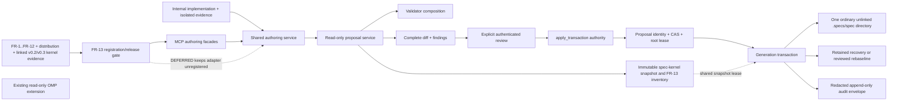

# Design

## Status and dependency boundary

This is a future architecture, not an implemented surface. Maintainers may build and internally verify its schema, shared service, real fixtures, recovery authority, and pure evaluator while lifecycle and action registration remain `DEFERRED`; FR-13 gates registration/release eligibility, not implementation start. The design extends the single `omp-spec-kit` package and its existing MCP server after the immutable read-only kernel and distribution gates are proven. MCP is the sole agent-facing authoring adapter; the existing OMP extension stays read-only. No second marketplace entry, plugin package, extension, or writer is introduced.

## Key decisions

### D-1 — Clean staged release

Authoring actions stay unregistered in `DEFERRED`, but the schema, shared service, fixtures, recovery authority, and pure eligibility evaluator may be implemented and exercised against isolated inputs to create candidate-bound evidence. The gate consumes `spec-authoring-workflow:FR-13`, the all-of result for mandatory FR-1..FR-12 evidence, current accepted `plugin-distribution:FR-13`, and exactly two accepted `spec-kernel:FR-14` results: v0.2/kernel-v0.2 artifact `A` and v0.3/kernel-v0.3 artifact `B` declaring `A` as its v0.2 parent. The hashes may legitimately differ; both results must be current, non-revoked, and bound to the same product revision and artifact lineage, while v0.3 and the current authoring/distribution evidence bind to the exact built release candidate/snapshot/policy/host. Only that result permits the existing extension to register authoring actions and enter release consideration.

**Trade-off:** implementation can progress and produce the evidence the gate needs without exposing an unproven writer; registration still cannot precede reliable reads, the retained same-lineage v0.2 predecessor, and complete v0.3/current-candidate safety proof.

### D-2 — Proposal is a value, not hidden state

A proposal is a content-addressed result returned to its caller. Each normal apply facade exposes two mutually exclusive calls: `phase: "review"` maps to `review_proposal`, records the authenticated complete-preview review, returns `REVIEWED`, and writes nothing; a later `phase: "commit"` maps to `apply_transaction` and accepts only that unexpired reviewed proposal plus current expected hashes. The `propose_patch` mode and `apply_spec_transaction` phase discriminators also route status, cancellation, retained recovery, rebaseline proposal and rebaseline commit to the same authority; every call performs one transition. It never accepts raw edits or reviews and commits in one call. The service may retain bounded in-memory/idempotency state during one process lifetime and does not write proposal state into the target repository.

**Trade-off:** callers may need to resend a content-addressed proposal and review attestation after restart; the review boundary remains observable and user repositories remain free of opaque control state.

### D-3 — No automatic rebase in the first mutation release

CAS mismatch always requires a new proposal. Anchor identity may make automatic rebase possible later, but silent rebase obscures exactly what the caller reviewed.

**Trade-off:** more retries under contention; stronger preview-to-commit identity.

### D-4 — One-spec generation swap

Multi-document atomicity is limited to one specification. The writer stages a complete generation under the same filesystem and swaps it while all kernel readers honor the shared snapshot coordinator. Cross-spec atomic changes return `CROSS_SPEC_TRANSACTION_UNSUPPORTED`.

**Trade-off:** cross-spec refactors require separately reviewed transactions and may temporarily be semantically inconsistent; the system refuses to pretend it can guarantee cross-spec atomicity.

### D-5 — Deny all symlink-like components

The root, spec-directory, and target chain reject symlinks, junctions, mount points, and reparse points. No allowlist exists, and containment refuses before document-content read.

**Trade-off:** repositories using linked spec directories are unsupported for both kernel reading and mutation until a separately specified safe containment policy exists.

### D-6 — Validation composition, not a second validator

The authoring service invokes the kernel's parser, identity, anchor, traceability, and conformance contracts over the proposed immutable generation. Authoring adds request, path, transaction, and task-transition checks; it does not fork kernel semantics.

### D-7 — Audit is returned; persistence is explicit

Every event returns a redacted envelope. Durable export uses a caller-provided sink with consent. No automatic `.logs`, database, ledger, or `.progress.json` is created in the target.

### D-8 — Mutation testing has a hard critical floor

All critical safety families require 100% killed. Engine, general threshold, timeout, and equivalent-mutant authority remain explicit decision items, so readiness cannot be laundered through an arbitrary percentage.

### D-9 — Recovery prefers retained bytes and uses reviewed rebaseline only when neither retained generation is complete and valid

`RECOVERY_REQUIRED` has two mutually exclusive bounded exits. If a complete retained original or result generation exists, a host-authenticated, unexpired `recover_transaction` selects it by complete hashes and revalidates it under the exclusive lease. If a hash-bound assessment proves neither retained generation is complete and valid, `propose_rebaseline_recovery` may read only an authorized ordinary unlinked candidate under the fixed root-contained `recovery-candidates/<candidate-id>/<spec-slug>` grammar, compare expected blocked-current/journal/candidate hashes, and return a complete dry-run proposal. Only a separately reviewed exact proposal may enter `apply_rebaseline_recovery`, which repeats all authorization, hash, containment, link, validator, audit-chain, and concurrency checks before an atomic `REBASELINED` generation. Requests never carry candidate bytes; failed-transaction journal, recovery material, and append-only audit history are never rewritten or erased.

**Trade-off:** an operator must stage a complete candidate under the selected root and perform proposal plus separate review, and unusable history remains retained; the service never guesses, silently overwrites, accepts unauthenticated bytes, or destroys forensic evidence.

## Components

### Eligibility gate

Inputs: exact built release-candidate artifact/snapshot/policy/host identity, product revision, artifact-lineage identity, mandatory evidence envelopes for FR-1..FR-12, current `plugin-distribution:FR-13`, and a closed kernel profile pair. The pair is exactly one accepted `kernel-release-eligibility@1` v0.2/kernel-v0.2 result with artifact hash `A` and null parent plus one accepted v0.3/kernel-v0.3 result with artifact hash `B` and `v02ParentArtifactSha256: A`; `A != B` is valid when this link and shared lineage hold. Output: `DEFERRED|ELIGIBLE|IMPLEMENTED|PROVEN`, implementation-evidence identities, separately identified v0.2 and v0.3 kernel results, every other qualified gate identity, missing/stale/revoked/red/duplicate/mismatched gates, registration state, and next action. The evaluator rejects a singleton or unqualified kernel result, duplicate target stages, v0.3 substitution for v0.2, a stale/revoked/non-eligible parent, or wrong lineage. It is pure and usable during `DEFERRED`; only its exact all-of `ELIGIBLE` result may register the existing extension actions.

### Root resolver

Accepts one explicit repository root. It canonicalizes root identity, rejects linked/reparse roots and spec-directory/target components before document-content read, validates target grammar, checks existing ancestors with lstat/realpath equivalents, applies Unicode NFKC and platform case-fold collision detection, and rechecks immediately before commit.

### Proposal service

Normalizes the closed edit union, applies it to immutable document bytes in memory, obtains validator findings, computes result hashes and deterministic diffs, and hashes canonical proposal content. Time and transport fields do not affect `proposalHash`. A separate review transition binds the authenticated actor to the complete untruncated preview hash; the service cannot self-review.

### Validator composition

Runs fixed lanes over one snapshot: schema, path, canonical document, parse/identity, forms, anchors/links, traceability, task guards, and conformance. Findings are stable ordered records. Error or unavailable mandatory lane blocks.

### Snapshot coordinator and lease

Kernel reads acquire a shared root-generation lease; mutations acquire an exclusive root lease. Lease identity is derived from canonical root fingerprint and stored outside the user's repository. Owner liveness and bounded wait prevent unsafe stale-lock takeover.

### Transaction writer

1. recover deterministically or refuse any prior interrupted transaction;
2. resolve an explicitly `REVIEWED`, unexpired proposal and verify its ID/hash and review attestation;
3. acquire the exclusive lease;
4. CAS every target and base snapshot;
5. create restrictive same-filesystem stage and preimage generation;
6. write complete staged generation;
7. synchronize supported file/directory metadata;
8. validate staged generation and recheck paths/CAS;
9. prepare audit envelope and explicit sink if configured;
10. swap generation under the coordinator;
11. verify result hashes, emit terminal envelope, and remove only ordinary commit transients; rebaseline delegates retention to the recovery coordinator and removes no failed-transaction/history material.

Failure transitions follow FR-6 exactly. Cleanup never removes the only proven recovery bytes, and rebaseline never deletes or rewrites the blocked transaction, journal, recovery assessment, or audit history.

### Recovery coordinator

The coordinator first hashes and assesses the blocked current generation, journal bytes or canonical missing-journal marker, and every retained original/result document under the exclusive lease. A complete retained generation routes exclusively to `recover_transaction`. Only a signed no-survivor assessment admits `propose_rebaseline_recovery`. The proposal resolver confines the candidate before content read, computes its complete inventory and full pre/post hashes, runs link closure and all mandatory validators, and emits no write. Apply consumes a separately reviewed proposal, repeats all identities plus the audit-chain head and lease ownership, then delegates the atomic generation install to the same transaction writer. Refusal preserves every input/history byte and keeps coordinator access blocked.

### Anchor editor

Selectors use canonical node ID or unique heading plus expected section hash. The editor consumes the authoritative `spec-kernel:FR-13` query for complete heading definitions, generated anchors, and link occurrences over one immutable repository snapshot; it preserves untouched bytes and EOL. `rename_heading` derives the new kernel slug and expands all same-spec inbound rewrites into the same proposal. Cross-spec, linked-directory, ambiguous, colliding, or incomplete inventory blocks.

### Task status reducer

A pure reducer owns the transition table and returns either canonical `TASKS.md` edit plus evidence references or a typed refusal. It never edits text directly. Raw status text changes detected in a general proposal must satisfy the same reducer output.

### Audit projector

Builds redacted, hash-chained event envelopes. Preview diff remains caller data, not audit data. Explicit sink adapters are outside the core and cannot change mutation semantics.

## Commit and recovery protocol

A transient transaction area is permitted only inside the selected spec's parent filesystem and only for the duration/recovery of a named transaction. It contains manifest hashes and required staged/preimage bytes, never credentials or unrelated files. Its path is implementation-private and must not be treated as product workflow state.

A commit marker identifies `oldGenerationHash`, `newGenerationHash`, journal hash, and state. On startup/invocation, deterministic recovery under the exclusive lease:

- accepts the new generation only when all expected hashes match;
- restores the old generation only when all preimage hashes match;
- otherwise materializes a hash-bound retained assessment, enters `RECOVERY_REQUIRED`, retains current/journal/original/result bytes, and blocks reads/writes through the authoring coordinator.

If either retained generation is complete and valid, `recover_transaction` accepts only an unexpired host authorization bound to actor, transaction, root, recovery mode, selected generation, and at most the canonical 15 documents. It verifies the complete inventory, containment, and every validator and transitions `RECOVERY_REQUIRED→RECOVERING→ROLLED_BACK|COMMITTED`.

If the assessment proves neither retained generation is complete and valid, `propose_rebaseline_recovery` is the sole alternative. Authorization binds actor, reason, transaction/root/target, fixed root-relative candidate source and fingerprint, document/time bounds, expected current snapshot/documents, journal or missing-marker hash, no-survivor assessment, and candidate snapshot/documents. Dry-run validates all bytes without writing and returns a complete pre/post proposal. After separate review, apply rechecks authorization, proposal/full-preview, current/journal/assessment/candidate hashes, containment, symlink/reparse absence, link closure, every validator, audit-chain head, and lease state, then atomically transitions `RECOVERY_REQUIRED→REBASELINING→REBASELINED`.

Any failed check returns to `RECOVERY_REQUIRED`; no normal reader/writer proceeds, no candidate content/path leaks, and no current, journal, recovery, candidate, or history byte is erased. Rebaseline appends its event to the prior digest chain and never edits the failed transaction record. The service never chooses by modification time or partial majority, accepts candidate bytes in a request, or uses rebaseline while either retained original or retained result is complete and valid; corrupt or incomplete retained directories may exist and do not by their path presence alone forbid rebaseline.

## Concurrency model

- Proposal reads may run concurrently on immutable snapshots.
- Exactly one mutation lease exists per canonical root.
- A transaction locks the root, not individual documents, to prevent cross-document generation tearing.
- Waiting writers re-read and re-CAS after acquiring the lease.
- Idempotency keys deduplicate retries; reuse with different canonical request hash refuses.
- A reader not using the shared coordinator is outside the guaranteed atomic observation boundary; release proof must show all shipped kernel readers use it.

## Security model

Trust boundaries are caller/operator authorization, selected root, candidate source, filesystem, validator/kernel, optional audit sink, and mutation runner. File locators and reasons are data and never executed. Errors disclose only request-related relative target identifiers and never a rebaseline candidate path or content. Backup/stage/recovery permissions are restrictive where supported. No model or shell command participates in mutation decisions.

## Alternatives rejected

- **Direct edit then validate:** corrupts before detection.
- **Automatic CAS rebase:** changes reviewed intent under contention.
- **Same-call preview and commit:** lets the service commit content the caller never separately reviewed.
- **Per-file rename marketed as multi-document atomic:** exposes mixed generations.
- **Following allowlisted symlinks:** leaves cross-platform race and containment ambiguity.
- **Repository-local SQLite/log ledger:** violates the hidden-state boundary.
- **Copying upstream MCP mutation tools:** imports dev-pomogator lifecycle and duplicates the standalone service.
- **Aggregate mutation percentage only:** can hide surviving critical checks.
- **Operator overwrite without a reviewed rebaseline proposal:** bypasses current/journal/candidate hash binding, validation, atomicity, and audit-history continuity.

## Open decisions

Only MP-1 through MP-4 in [RESEARCH.md](RESEARCH.md#open-mutation-policy-decisions) remain unresolved. Their decision owner and evidence trigger are explicit. No other design item is intentionally open.
