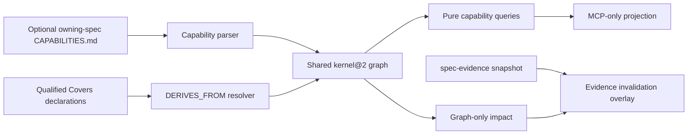

# Design

## Context

Capability data adds a product-meaning layer above requirements without changing historical kernel@1. The future implementation is a `spec-kernel@2` extension and remains inside the one product/one graph/one MCP door. Capability definitions belong to the spec that owns the product behavior; this specification owns only the extension contract.

## Component model

Repository-root future sources follow the existing JavaScript build convention:

- `src/kernel/extensions/capability/schema.js` — node/edge/diagnostic registration;
- `src/kernel/parsers/capability.js` — optional owning-spec document parser;
- `src/kernel/graph/capability-edges.js` — qualified Covers resolution;
- `src/kernel/query/capability.js` — requirementsOf/capabilitiesOf/getImpact;
- `src/evidence/capability-invalidation.js` — evidence overlay;
- `src/mcp/capability-tools.js` — one-to-one MCP registration.

No hand-edited child `plugins/omp-spec-kit/src/**` and no capability `pi.registerTool` surface exist.

## Identity and document decision

`<owning-spec>:CAP-N[.M]` is the only canonical identity. Optional `<owning-spec>/CAPABILITIES.md` enters the kernel@2 source union as CAPABILITY_DOCUMENT. Product-level capabilities initially belong to `product`. A repository-root singleton and bare CAP canonical IDs are rejected because they cannot satisfy kernel identity/source invariants.

The spec-repair corpus does not add a live CAPABILITIES.md: historical kernel@1 continues to parse the same 150 documents. Kernel@2 implementation fixtures exercise the optional document before a product registry is authored.

## Derivation decision

Only a qualified `Covers` field creates DERIVES_FROM. Requirement hyperlinks remain navigation REFS. This reuses the existing structured-field parser and closed endpoint discipline instead of inventing inference from prose.

## Query decisions

- `requirementsOf` and `capabilitiesOf` query the immutable graph with stable cursors and explicit archive controls.
- `getImpact` returns only canonical graph IDs; it has no evidence dependency.
- `invalidateEvidence` is a separate evidence-layer operation requiring an explicit evidence fingerprint/result bindings.

The separation prevents a pure graph query from fabricating producer-result identities it cannot observe.

## Projection and release

MCP is the sole agent-facing projection. The capability aggregate requires delivered v0.3 baseline, accepted kernel@2 profile and the exact 16 graph-profile or 18 overlay-profile records. Shipping invalidation additionally requires accepted evidence MCP plus the exact `spec-evidence@2.deterministicFingerprint` snapshot and current kernel binding proof; no sibling capability is implied.
