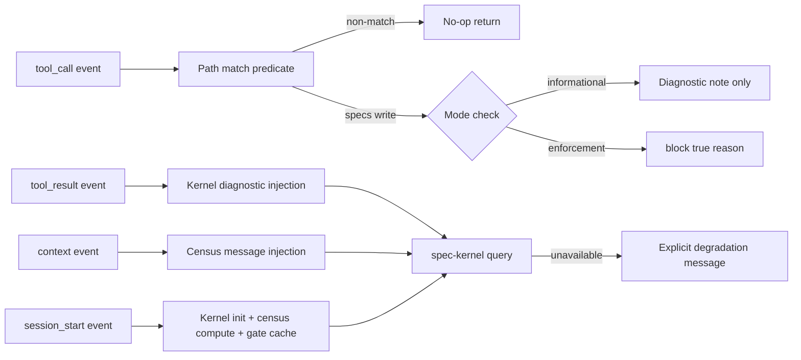

# Design

## Context

OMP v17.3.7 provides hook events (`tool_call`, `tool_result`, `context`, session lifecycle) that enable pre-execution interception, post-execution diagnostic injection, and message augmentation. The upstream FR-39 concept (MCP-only spec access + audit) is deferred per `MIGRATION_MATRIX.md`, but the enforcement *concept* survives on OMP-native surfaces. This design ports spec-discipline enforcement onto pinned OMP extension surfaces without Claude hooks, without MCP, without audit logs, and without any external dependency, per the repository single-plugin boundary and the `plan-gate` sibling precedent.

## Component boundary

### Planned layout under repository-root `src/enforcement/`

Sources follow the house build convention (`docs/omp-v17.3.7-contract.md`, `scripts/build-plugin.mjs`): plain JavaScript with JSDoc types at the repository root, copied by the build script into the child `dist/`; the child package tree itself never holds enforcement sources.

- `match.js` — pure predicate over `toolName` + target path; no I/O. Normalizes separators, rejects traversal/symlinks, checks `.specs/` prefix.
- `mode.js` — mode determination: reads cumulative gate status at `session_start`, caches for session duration. Returns `informational | enforcement | degraded`.
- `diagnostics.js` — kernel query adapter + bounded diagnostic rendering. Translates `spec-kernel:FR-6` findings into ≤2 KiB content additions.
- `census.js` — corpus overview query + bounded census rendering. Produces ≤4 KiB context messages from kernel overview.
- `block.js` — enforcement-mode block reason renderer. Produces bounded `{block: true, reason}` with actionable redirect to authoring door.
- `fail-honest.js` — fault barrier translating every internal exception into explicit diagnostic content. Wraps all handler bodies.
- `adapter.js` — OMP event subscriptions and handler registration. Single entry point for the extension factory.

The pure match predicate receives tool name and input only; it never imports OMP, reads a clock, or writes. OMP-facing glue (event subscription, result translation, fault wrapping) lives in the adapter and is the only code allowed to touch hook APIs.

## Matching algorithm

1. `tool_call` arrives: if `toolName` is not `write`, `edit`, or `bash`, return immediately (no I/O).
2. For `write`/`edit`: extract target path from `input.file_path` or equivalent field (TASK-1 probe obligation). Normalize separators to `/`. Reject absolute paths outside project root, `..` traversal, and symlinks.
3. Check normalized path prefix against `.specs/`. Non-match returns immediately.
4. For `bash`: extract `input.command` string. Apply pattern matching for file-write operations targeting `.specs/` (e.g., redirection operators, `tee`, `cp`, `mv` with `.specs/` arguments). Non-match returns immediately.
5. Match found: proceed to mode check.

Probe obligations (TASK-1): confirm exact `input` field names for `write`, `edit`, `bash`; confirm path normalization behavior; confirm that extension-registered tools also emit `tool_call`.

## Mode determination

1. At `session_start`: query cumulative gate status (`product:FR-6` + `spec-authoring-workflow:FR-13` acceptance). Cache result.
2. If gate accepted → mode = `enforcement`.
3. If gate not accepted but kernel available → mode = `informational`.
4. If kernel unavailable → mode = `degraded` (explicit diagnostic at session start).
5. Mode is immutable for the session duration.

## Diagnostic injection algorithm

1. `tool_result` fires after successful spec-file read/edit.
2. Extract spec slug from the touched path.
3. Query kernel for diagnostics on that slug (bounded, with timeout).
4. Render findings into ≤2 KiB content addition using kernel diagnostic format.
5. Append to result content array. Original content is preserved.
6. On kernel error: render explicit "kernel unavailable" diagnostic instead.

## Census injection algorithm

1. `session_start` fires: compute corpus overview via kernel `overview` query.
2. Cache rendered census summary (≤4 KiB).
3. Next `context` event: append census as system-role message to outgoing messages deep copy.
4. Clear cached census after injection (inject once per session).
5. On kernel error: render explicit "corpus census unavailable" message instead.

## Decisions

### DEC-1: Fail-honest over fail-open

Unlike `plan-gate` which compensates OMP's fail-closed default to fail-open, this spec uses fail-honest: every fault produces an explicit visible message. Rationale: enforcement-mode silent blocking creates false negatives (legitimate work blocked without explanation), while informational-mode silence creates false confidence (agent unaware of spec problems). Both are worse than honest degradation.

### DEC-2: No audit log

`MIGRATION_MATRIX.md` defers FR-39 audit log to a later adapter/policy stage. This spec introduces no persistent audit trail. All observable state surfaces through event-visible records. A future adapter stage may add audit logging with its own privacy/state policy.

### DEC-3: Session-scoped gate cache

Gate status is evaluated once at `session_start` and cached. Mid-session re-evaluation would require additional event subscriptions and introduce non-determinism. Sessions are short-lived enough that stale gate status is acceptable; a new session picks up the current gate state.

### DEC-4: Kernel queries are bounded and optional

All kernel queries have timeouts and byte limits. Kernel absence degrades honestly rather than failing the session. The enforcement hooks are consumers of kernel output, not dependents of kernel availability.

### DEC-5: Path matching is conservative

Path matching normalizes separators, rejects traversal and symlinks, and stays inside the project root. Over-matching (blocking legitimate non-spec writes) is preferred over under-matching (missing spec writes) because over-matching produces visible block reasons while under-matching produces silent policy violations.

### DEC-6: Stage separation from plan-gate

This spec shares event surfaces and distribution posture with `plan-gate` but targets different interception points (`.specs/**` writes vs. `xd://propose` writes), different decision contracts (redirect-to-door vs. content-validation), and different activation gates (authoring cumulative gate vs. plan-mode signal). Merging would create coupling between independent release timelines.
