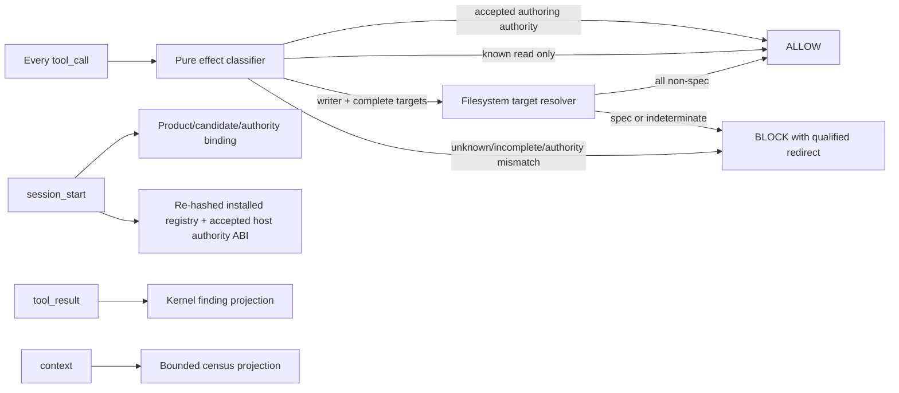

# Design

## Context

`spec-enforcement` is a future post-v0.3 capability inside the existing `omp-spec-kit` extension. It does not add a plugin, extension factory, MCP server, validator, or agent tool. Its write policy redirects only to the accepted proposal-first `omp-spec-kit` authoring MCP authority. Full source FR-39 (MCP-only access plus persistent audit) remains `DEFER`; this capability implements pre-execution effect enforcement and honest diagnostics without claiming the deferred audit log.

The central problem is no-bypass classification. Checking only `write`, `edit`, and `bash` names is incomplete, regex command matching cannot prove dynamic targets, and a pure matcher cannot inspect symlinks/reparse points. The repaired design uses a closed effect registry, an I/O-capable containment resolver, and a conservative unknown-tool policy.

## Component boundary



`tool_call` classification runs for every host-visible tool. No early name filter bypasses the registry. Informational mode computes the same would-block decision but never blocks. Enforcement mode conservatively blocks any effect it cannot prove safe.

## Root-source layout and integration

Plain root JavaScript with JSDoc types remains source of truth. The build script copies/bundles accepted files into `plugins/omp-spec-kit/dist/**`.

- `src/enforcement/registry.js` — pinned `ToolEffectRegistryManifestV2` and live-registry comparison.
- `src/enforcement/classify.js` — pure registry/input classification and target extraction.
- `src/enforcement/command-effects.js` — bounded `command-effects@1` grammar; unsupported/dynamic syntax is incomplete, never allowed by regex.
- `src/enforcement/resolve-targets.js` — filesystem-backed project/spec containment.
- `src/enforcement/decision.js` — mode/effect/resolution/authority policy.
- `src/enforcement/mode.js` — same-candidate product and authoring-authority binding.
- `src/enforcement/diagnostics.js` — kernel findings plus separate enforcement-policy diagnostics.
- `src/enforcement/census.js` — bounded kernel overview projection.
- `src/enforcement/release.js` — pure `spec-enforcement-release@2` evaluator.
- `src/enforcement/register.js` — registers event handlers on an existing `ExtensionAPI` instance.
- `src/v0.1/extension.js` — imports and invokes `registerSpecEnforcement(pi, deps)` only after the capability is accepted for the built candidate.
- `scripts/build-plugin.mjs` — closed root-source/output allowlist and manifest hashes.

There is no standalone enforcement default export or second factory. The current `src/v0.1/extension.js` remains the single extension entry and existing read-only tool registration remains intact.

## Closed tool-effect registry

Each supported host pin ships a unique canonical entry for every host-visible tool:

```text
{toolName, effect, targetExtractor, authority}
```

Effects:

- `READ_ONLY` — no mutation target and no authoring authority.
- `MAY_WRITE_TARGETS` — exhaustive versioned target extractor required.
- `SPEC_AUTHORING_AUTHORITY` — exact accepted MCP server/profile/tool/candidate manifest; no raw target extractor.
- `UNKNOWN` — synthesized for absent/changed names, input-shape mismatch, dynamic/incomplete extraction, or authority mismatch.

The registry covers built-ins, MCP tools, and extension-registered tools. At `session_start`, candidate-bundled installed registry/authority manifests are re-hashed. Pinned v17.3.7 does not expose a live provider/server/schema census; activation waits for `tool-call-authority-abi@1`. Mismatch emits a visible pin diagnostic. If product capability evidence is otherwise accepted, enforcement stays active and new/changed tools become `UNKNOWN`; downgrading would create a bypass.

## Authoring authority

The only redirect/allow authority is MCP server `omp-spec-kit` bound to the accepted `spec-authoring-workflow@1` or separately accepted `@2` manifest and the same candidate artifact. The manifest contains the exact 17 v1 or seven v2 facade names and the service request schema hash. Tool-name equality alone is not authority.

A valid authority call passes through because the authoring service itself enforces proposal, separate review, CAS, containment, atomicity, rollback, and evidence. Raw filesystem tools never become authoritative by naming the door in an argument.

## Classification and target extraction

1. Look up the exact hook tool name and host-authenticated provider/server/schema identity in the closed registry.
2. Verify the runtime input shape against the versioned extractor descriptor.
3. `READ_ONLY`: return complete classification with no targets.
4. `SPEC_AUTHORING_AUTHORITY`: verify server/profile/tool/candidate/service-schema/manifest identities.
5. `MAY_WRITE_TARGETS`: extract every possible target. JSON-pointer extractors reject missing/wrong-shaped fields. Command tools use `command-effects@1`; unsupported quoting, substitution, redirection, shell syntax, computed destinations, or subprocess indirection returns incomplete.
6. Any missing entry, mismatch, dynamic effect, or non-exhaustive extraction becomes `UNKNOWN`.

Classification is pure and makes no containment claim.

## Filesystem-backed containment

For each raw target, `resolve-targets.js`:

1. resolves the canonical project root;
2. rejects absolute targets outside it and lexical `..` traversal;
3. walks existing ancestors using lstat/realpath;
4. rejects Windows reparse points and POSIX symlinks at root, `.specs`, ancestor, or target;
5. for a not-yet-existing target, resolves the nearest existing ancestor and appends only ordinary normalized segments;
6. returns repository-relative path plus `SPEC`, `NON_SPEC`, or `INDETERMINATE` and a closed code.

Resolver exceptions, timeouts, missing ancestors, or mixed incomplete results are `INDETERMINATE`. The pure classifier never “rejects symlinks” because it has no filesystem capability.

## Decision table

| Mode | Classification | Resolution | Decision |
|---|---|---|---|
| informational | any | any | ALLOW; optionally report would-block |
| enforcement | exact accepted authoring authority | n/a | ALLOW |
| enforcement | known read-only | n/a | ALLOW |
| enforcement | writer | all targets proven non-spec | ALLOW |
| enforcement | writer | any spec target | BLOCK `RAW_SPEC_WRITE` |
| enforcement | unknown/incomplete/authority mismatch | n/a | BLOCK |
| enforcement | writer | any indeterminate/resolver fault | BLOCK `TARGET_INDETERMINATE` |

Block reasons are at most 4 KiB, name the tool, repository-relative target when known, closed code, and `omp-spec-kit:spec-authoring-workflow` redirect. They contain no arbitrary endpoint, absolute path, stack, environment, or credential.

## Mode and product ownership

At `session_start`, mode binding consumes the product evaluator result for the exact built candidate:

- delivered v0.3 baseline;
- accepted `AUTHORING_MCP` capability and exact authority manifest;
- accepted `spec-enforcement:FR-11` eligibility;
- accepted `SPEC_ENFORCEMENT` capability for the same candidate.

Before this conjunction and an accepted host authority ABI receipt, behavior is informational/degraded only. Local flags cannot promote it. Product/candidate/authority mismatch prevents activation. Installed-registry/host-envelope mismatch does not disable accepted enforcement; conservative unknown-tool blocking preserves no-bypass.

## Diagnostics and fail-honest behavior

Two record classes remain distinct:

- kernel spec-conformance findings, always traceable to `spec-kernel:FR-6`;
- enforcement-policy diagnostics for registry, authority, containment, product gate, or handler faults.

Informational kernel/render faults are visible and non-blocking. Enforcement-critical classification/authority/containment faults are visible BLOCK decisions, not silent pass-through. Handler exceptions are caught before OMP's outer fail-closed boundary and rendered with a closed code. No policy diagnostic may claim a spec is conformant.

## Release evidence

`spec-enforcement-release@2` is capability-only. It binds one candidate to baseline/authoring evidence, authoring authority manifest, effect/installed registry and host-ABI digests, typed attested producer check receipts, installed dependency-absent proof, Windows/POSIX containment, unknown/new/dynamic tool attacks, budgets, and independent adversarial review. The product evaluator alone may mark `SPEC_ENFORCEMENT` accepted/delivered.

## Decisions

### DEC-1: Effect registry, not a tool-name shortlist

A three-name shortlist misses extension/MCP/future tools. Exact registry entries make supported effects reviewable; unknown inputs block conservatively.

### DEC-2: Filesystem truth belongs to an I/O resolver

A pure function can normalize text but cannot prove symlink/reparse/realpath containment. Separating extraction from resolution makes both contracts executable.

### DEC-3: Only qualified authoring MCP authority may mutate specs

An arbitrary “door command or API” is a bypass. Exact server/profile/tool/candidate/service-schema binding reuses the proposal-first authoring authority without introducing a second writer.

### DEC-4: Registry drift does not disable enforcement

Disabling on a newly visible tool would open the exact gap the policy is meant to close. Drift is diagnostic; unknown tools block until a reviewed manifest update.

### DEC-5: FR-39 remains DEFER

This capability enforces access and keeps bounded session records, but does not implement the source feature's persistent audit log. The migration disposition stays honest.

### DEC-6: One extension factory

`registerSpecEnforcement` is imported by the existing root extension entry. A standalone adapter/factory would be unreachable or create a second control plane.
