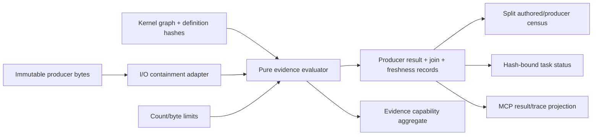

# Design

## Context

The spec-kernel produces an immutable graph of definitions, references, headings, links, nodes, and edges with conservation-checked diagnostics. It explicitly does not evaluate whether tests passed, whether evidence is fresh, or whether tasks are verified (`spec-kernel:FR-6`). This specification defines the evidence/honesty layer that consumes the kernel graph as one immutable input and execution-artifact bytes as a second immutable input, producing verdicts the kernel cannot produce. Upstream concepts from `docs/upstream/dev-pomogator/spec-generator-v4/` (honesty-gate, NDJSON ingestion, coverage census) inform this design as provenance only.

## Component boundary

### Planned layout under repository-root `src/evidence/`

Sources follow the house build convention: plain JavaScript with JSDoc types at the repository root, copied by the build script into the child `dist/`.

- `evaluate.js` — pure evaluator entry (`evaluate(input): EvaluationOutput`).
- `ingest/index.js` — artifact ingestion dispatcher.
- `ingest/cucumber-messages.js` — Cucumber Messages NDJSON parser.
- `ingest/pytest-bdd.js` — pytest-bdd cucumber-json parser.
- `ingest/overlay.js` — scenario-result overlay parser.
- `join.js` — scenario result join by ID, tag, name fallback.
- `freshness.js` — compare graph/scenario/step-binding/implementation hashes; timestamps display only.
- `status.js` — all-not-any task evidence derivation with explicit evidence hashes.
- `waiver.js` — waiver honesty enforcement.
- `census.js` — separate authored-scenario and producer-row conservation.
- `invariants.js` — anti-false-green binding checks.
- `release.js` — exact FR-1..FR-14 manifest/record evaluator.
- `mcp-projection.js` — read-only `get_test_result` / `get_scenario_trace` envelopes.
- `adapter.js` — I/O adapter for artifact retrieval and containment.

The pure evaluator receives kernel graph, artifact bytes, and limits only; it never imports OMP, reads a clock directly, or writes. Adapters handle all I/O and are the only code allowed to touch filesystem or external APIs.

## Evaluation pipeline

Phases run in fixed order; each phase is a pure function of its inputs.

1. **Admission:** Re-hash PRESENT bytes, admit exact kind/version pairs, and map PRESENT/ABSENT/caller-SKIPPED to the discriminated records; unsupported identity and malformed/missing-results remain distinct.
2. **Ingestion:** Parse supported producer bytes and preserve every producer row, status, layer, run and trace identity.
3. **Join:** Match by qualified ID → tag → name fallback; every producer row has one outcome.
4. **Freshness:** Compare evidence graph/scenario/step-binding/implementation hashes with current bindings.
5. **Waiver/status:** Derive explicit task states from fresh PASSED canonical rows and evidence hashes.
6. **Census:** Reconcile unique authored scenarios separately from producer result rows.
7. **Invariants:** Reject unsupported status/freshness/trace claims and enforce byte/count bounds.
8. **Output:** Assemble deterministic evaluator, MCP projection and release-record inputs without I/O.

## Join algorithm

1. For each valid producer result, attempt join by qualified scenario ID (exact match against kernel graph scenario nodes).
2. If no ID match, attempt join by tag (producer result tags matched against canonical scenario identifiers).
3. If no tag match, attempt join by name (normalized scenario name comparison when executed feature paths differ from canonical mirrors).
4. Multiple same-priority candidates record AMBIGUOUS_JOIN with candidates.
5. No candidate records UNMATCHED.
6. Result/join collection lengths, unique IDs and joined/unmatched/ambiguous membership conserve exactly.

## Freshness algorithm

1. Resolve current graph, scenario content, step-binding applicability/hash and implementation applicability/hash from the kernel snapshot.
2. Read the same four dimensions from each producer result binding.
3. Applicability mismatch or unequal applicable hash yields STALE with exact dimensions.
4. Applicable-but-missing binding yields INDETERMINATE.
5. Equal hashes for every applicable dimension (and matching not-applicable bits) yield FRESH.
6. Timestamps remain display-only.
7. Only FRESH PASSED CANONICAL rows satisfy `done-verified`.

## Decisions

### DEC-1: Pure evaluation mirrors spec-kernel:FR-1

The evaluator is a pure function with no internal I/O, mirroring the kernel's discipline. This ensures determinism, testability, and separation of concerns. Adapters are the sole I/O boundary.

### DEC-2: Canonical format is Cucumber Messages NDJSON

Per upstream FR-9 adoption, Cucumber Messages NDJSON is the canonical language-neutral format. Other formats are supported but secondary. This ensures multi-runner portability.

### DEC-3: Overlays supplement, never replace

Per upstream FR-56 adoption, canonical full-run results are retained separately from overlays. This prevents stale overlays from silently replacing current truth.

### DEC-4: All-not-any rollups

Per upstream FR-35 adoption and incident class 526, one green among siblings verifies nothing. Every required scenario must have fresh green evidence for DONE/verified. This is stricter than any-of semantics and prevents false-green rollups.

### DEC-5: Waiver is a named state

Per upstream FR-50 adoption, waiver is distinct from completion. Waived tasks remain visible in authored totals but excluded from satisfied counts. This prevents silent laundering of waived work.
