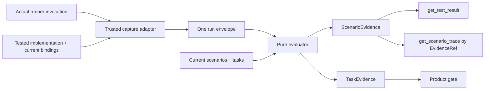

# Design

## Context

The kernel owns definitions and current trace relationships but deliberately never turns structure into passing-test truth. Evidence therefore stays in a separate layer. The earlier draft added overlay artifacts, sidecar authentication, graph-wide fingerprints, public census equations, duplicated result/trace identities, and a release-record protocol. None is needed for the user invariant.

## Components

Planned root-source layout:

- `src/evidence/capture.js` — containment, actual runner capture, scope derivation, hashes.
- `src/evidence/ingest/cucumber-messages.js` and `pytest-bdd.js` — real producer parsers.
- `src/evidence/evaluate.js` — pure orchestration.
- `src/evidence/join.js` — stable ID/tag join and name diagnostics.
- `src/evidence/freshness.js` — scenario/step/implementation comparison.
- `src/evidence/readiness.js` — all-not-any task evidence and waiver state.
- `src/evidence/mcp-projection.js` — result and trace projection using one evidence reference.

## Evaluation pipeline

1. **Capture:** the trusted adapter records actual bytes, computes hashes, derives FULL/PARTIAL from the invocation, and binds the tested implementation and current scenario definitions.
2. **Admission:** the evaluator re-hashes bytes and parses only supported producer identities.
3. **Join:** exact qualified ID, then uniquely verified canonical tag. Names only produce candidates in diagnostics.
4. **Freshness:** compare scenario content, applicable step binding, and tested implementation identity. No graph-wide per-result hash or clock.
5. **Readiness:** every current required scenario needs PASSED/FRESH/FULL evidence. Waived tasks remain WAIVED_OPEN.
6. **Projection:** `get_test_result` returns one `ScenarioEvidence`; trace lookup uses its `EvidenceRef`.

Every parsed row receives one join outcome and every required scenario receives one satisfying evidence reference or blocker. Clients derive counts from these records.

## Decisions

### DEC-1: Trust the capture boundary, not self-declared hashes

The local adapter is trusted to observe the actual run and compute bindings. Re-hashing proves byte integrity, not producer authenticity. If adversarial attestation is later required, it is a separate capability with an external trust root.

### DEC-2: Full scope is captured behavior

FULL is not a caller label. The adapter derives it from the invocation and expected set. Partial runs are useful diagnostics but never readiness authority.

### DEC-3: Stable identity only

Qualified scenario ID and verified canonical tag are the authority path. Names help explain unmatched rows but cannot silently bind evidence.

### DEC-4: Freshness is local to the tested scenario

Scenario content, applicable step binding, and implementation identity protect the observable result. Current task membership comes from the current snapshot, so a newly required scenario becomes missing without invalidating unrelated results through a whole-graph hash.

### DEC-5: One evidence identity

`(artifactSha256, producerResultId)` identifies result and trace. The result view does not copy trace identity, and trace paging does not invent another fingerprint protocol.

### DEC-6: Product composition stays in product

This evaluator produces ordinary task/scenario evidence. Product decides release readiness. There is no evidence-specific check census or release manifest.
