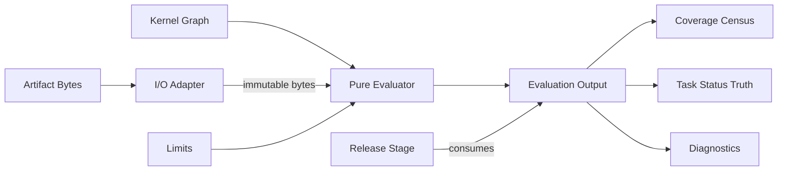

# Design

## Context

The spec-kernel produces an immutable graph of definitions, references, headings, links, nodes, and edges with conservation-checked diagnostics. It explicitly does not evaluate whether tests passed, whether evidence is fresh, or whether tasks are verified (`spec-kernel:FR-6`). This specification defines the evidence/honesty layer that consumes the kernel graph as one immutable input and execution-artifact bytes as a second immutable input, producing verdicts the kernel cannot produce. Upstream concepts from `docs/upstream/dev-pomogator/spec-generator-v4/` (honesty-gate, NDJSON ingestion, coverage census) inform this design as provenance only.

## Component boundary

### Planned layout under repository-root `src/evidence/`

Sources follow the house build convention: plain JavaScript with JSDoc types at the repository root, copied by the build script into the child `dist/`.

- `evaluate.js` — pure evaluator entry (`evaluate(input): EvaluationOutput`).
- `ingest/index.js` — artifact ingestion dispatcher.
- `ingest/cucumber-messages.js` — Cucumber Messages NDJSON parser.
- `ingest/pytest-bdd.js` — pytest-bdd cucumber-json parser.
- `ingest/overlay.js` — scenario-result overlay parser.
- `join.js` — scenario result join by ID, tag, name fallback.
- `freshness.js` — freshness/staleness comparison against kernel source timestamps.
- `status.js` — fail-closed task status derivation with all-not-any rollups.
- `waiver.js` — waiver honesty enforcement.
- `census.js` — coverage census with conservation equations.
- `invariants.js` — anti-false-green invariant checks.
- `release.js` — release-eligibility contribution evaluator.
- `adapter.js` — I/O adapter for artifact retrieval and containment.

The pure evaluator receives kernel graph, artifact bytes, and limits only; it never imports OMP, reads a clock directly, or writes. Adapters handle all I/O and are the only code allowed to touch filesystem or external APIs.

## Evaluation pipeline

Phases run in fixed order; each phase is a pure function of its inputs.

1. **Ingestion:** Parse each artifact according to its declared kind/version. Produce ingestion state (INGESTED/NOT_INGESTED/SKIPPED) with closed reasons and counts.
2. **Join:** Match producer results to canonical scenarios by qualified ID → tag → name fallback. Record join outcome (JOINED/UNMATCHED/AMBIGUOUS_JOIN) for every result.
3. **Freshness:** Compare result timestamps against kernel source timestamps. Record freshness verdict (FRESH/STALE/INDETERMINATE) per joined result.
4. **Waiver:** Identify waived tasks from kernel graph. Mark them open-waived regardless of evidence.
5. **Status:** Derive task status using all-not-any semantics over fresh green evidence. Produce DONE/verified, DONE-but-unverified, open-waived, or not-DONE.
6. **Census:** Compute coverage census with conservation equations. Flag violations.
7. **Invariants:** Check anti-false-green invariants. Produce diagnostics for breaches.
8. **Output:** Assemble evaluation output with all phases' results, diagnostics, and deterministic fingerprint.

## Join algorithm

1. For each valid producer result, attempt join by qualified scenario ID (exact match against kernel graph scenario nodes).
2. If no ID match, attempt join by tag (producer result tags matched against canonical scenario identifiers).
3. If no tag match, attempt join by name (normalized scenario name comparison when executed feature paths differ from canonical mirrors).
4. If multiple candidates match at the same priority level, record AMBIGUOUS_JOIN rather than arbitrary selection.
5. If no candidate matches at any level, record UNMATCHED.
6. Conservation: every valid result has exactly one join outcome.

## Freshness algorithm

1. For each joined result, extract the result timestamp from the artifact.
2. Extract the scenario definition timestamp and step-definition timestamps from the kernel graph's heading/span metadata.
3. If the result timestamp is older than any source timestamp it claims, mark STALE.
4. If either timestamp is absent, mark INDETERMINATE.
5. Otherwise mark FRESH.
6. STALE and INDETERMINATE results do not satisfy DONE/verified.

## Decisions

### DEC-1: Pure evaluation mirrors spec-kernel:FR-1

The evaluator is a pure function with no internal I/O, mirroring the kernel's discipline. This ensures determinism, testability, and separation of concerns. Adapters are the sole I/O boundary.

### DEC-2: Canonical format is Cucumber Messages NDJSON

Per upstream FR-9 adoption, Cucumber Messages NDJSON is the canonical language-neutral format. Other formats are supported but secondary. This ensures multi-runner portability.

### DEC-3: Overlays supplement, never replace

Per upstream FR-56 adoption, canonical full-run results are retained separately from overlays. This prevents stale overlays from silently replacing current truth.

### DEC-4: All-not-any rollups

Per upstream FR-35 adoption and incident class 526, one green among siblings verifies nothing. Every required scenario must have fresh green evidence for DONE/verified. This is stricter than any-of semantics and prevents false-green rollups.

### DEC-5: Waiver is a named state

Per upstream FR-50 adoption, waiver is distinct from completion. Waived tasks remain visible in authored totals but excluded from satisfied counts. This prevents silent laundering of waived work.
