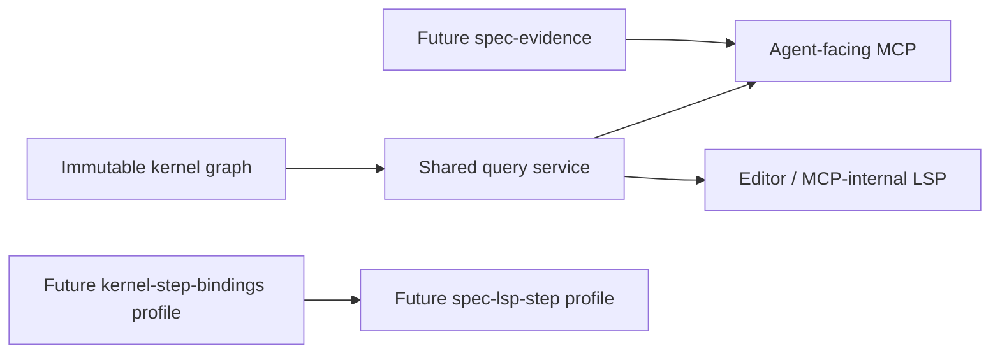

# Design

## Boundary

The LSP server is an editor/MCP-internal projection of the shared kernel. The agent-facing spec API remains MCP. Current `spec-lsp-read@1` adds no parser, graph, verdict, evidence or mutation semantics.

## Current profile components

Repository-root sources live under `src/lsp/*.js` and are bundled into generated plugin `dist/` output.

- initialize/lifecycle adapter for OMP lazy/shared semantics;
- kernel finding→LSP diagnostic mapper;
- definition/references adapter over kernel identities/occurrences;
- alias completion and documentSymbol projector;
- kernel-only hover projector;
- contained didSave rebuild coordinator.

No codeAction, WorkspaceEdit, evidence fields, step matcher, cucumber language server, oracle fixture, writer or second graph exists.

## Hover decision

Current hover contains only kernel node body/authored status and scenario name/keyword/tags/steps. Result, provenance, freshness, run and trace data belong to the evidence MCP tools. The LSP schema forbids them rather than returning empty placeholders.

## Save/rebuild decision

Current profile uses the existing bounded full snapshot rebuild on didSave. Lazy start is required. Rebuild latency is measured and reported, but 150 ms is not a release threshold. An incremental claim requires a separately accepted kernel incremental profile.

## Step profile decision

Current CHK-FR7-01 and CHK-FR12-01 are absence proofs. Future `spec-lsp-step@1` depends on accepted `kernel-step-bindings@1` and only projects kernel diagnostics/BINDS_STEP edges. It has its own release check and fixtures; it never changes the current profile retrospectively.

## MCP/LSP interaction

MCP may consume kernel or LSP navigation internally; this does not expose LSP to the agent. Editor diagnostics remain driven by OMP `lsp.diagnosticsOnWrite`. MCP/kernel and LSP responses normalize complete related diagnostics and ranges to the closed Unicode-scalar `LspKernelProjectionV1`; negotiated UTF-32/UTF-16 conversion occurs only at the LSP boundary; only JSON-RPC ID, server name, request timing and URI syntax are removed before canonical-byte parity.

## Containment and distribution

The server accepts an explicit canonical repository root containing `.specs/` and indexes only contained `.specs/**` Markdown/features. Other routed Markdown returns empty results. External roots and escaping traversal/symlink/junction/reparse descendants refuse. Graph unavailability yields empty LSP results/diagnostics plus separate `SpecLspAvailabilityStatusV1`, never an adapter diagnostic. `vscode-languageserver` is bundled; no native binary or cucumber library is required by the current profile.

## Release profiles

- `spec-lsp-read@1`: exact CHK-FR1-01..CHK-FR12-01 plus seven explicit NFR-bound checks, where CHK-FR12-01 proves absence.
- `spec-lsp-step@1`: accepted read profile + qualified `spec-kernel:CHK-FR15-01` + local CHK-FR7-02.

Every record and rehashed evidence document is candidate/kernel-baseline/kernel-fingerprint/corpus bound; current eligibility proves an accepted kernel-v0.2 receipt, and future step eligibility additionally proves an eligible read result plus the separately accepted step profile. Specification text is not evidence.
