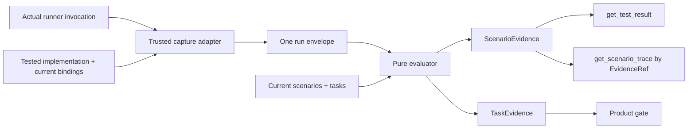

# DESIGN

## Read / Core

## Boundary

The product is one pure graph/query core with thin host adapters.

flowchart LR
  Sources[Caller-supplied canonical SourceDocument values] --> Core[Occurrence-first graph core]
  Core --> Primitives[Four internal primitives]
  Primitives --> OMP[OMP compatibility adapter]
  Primitives --> MCP[MCP compatibility adapter]
  Fixtures[Real immutable fixtures] --> Core

The core receives source bytes, parser schema, limits, and cancellation. It owns normalization, role-aware parsing, occurrence conservation, identity, typed edges, deterministic diagnostics, graph fingerprinting, and bounded queries. It performs no filesystem, clock, environment, process, network, OMP, or MCP access.

Host adapters own transport and repository reading. They supply already-contained canonical documents and project the core envelope without adding graph semantics. Editor navigation and anchors remain outside the kernel. A producer may supply normalized step-binding records; the kernel does not parse JavaScript or implement a Cucumber matcher.

## Source and graph flow

1. The caller supplies the complete canonical document snapshot from the fifteen-name allowlist.
2. The core normalizes encoding, line endings, paths, parser schema, and effective membership limits.
3. Parsers emit source occurrences before any maps are built.
4. Identity resolution qualifies local IDs with the immediate spec slug.
5. The graph builder elects only one candidate, preserves ambiguous candidates, resolves typed edges, and records every unresolved outcome.
6. Diagnostics and deterministic counts are computed before the snapshot fingerprint.
7. The four primitives read the immutable graph through one cursor/error envelope.

## Compatibility boundary

The released v0.3.2 adapter names are compatibility spellings, not core primitives. They remain thin mappings over the four primitives and preserve their historical result carriers only where a released decoder or serializer requires them. No second graph, runtime, or query service is introduced.

The MCP compatibility mappings are exact and intentionally finite as a first slice:

| MCP name | Core projection |
|---|---|
| `spec_inventory` | `inventory` |
| `spec_get_node` | `findNodes` with an exact identity filter |
| `spec_find_nodes` | `findNodes` |
| `spec_get_edges` | `traverse` with depth one |
| `spec_trace` | `traverse` |
| `spec_diagnostics` | `diagnostics` |
| `spec_overview` | `inventory` summary |
| `spec_markdown_inventory` | `inventory` of producer-supplied normalized document occurrences |

## Invariants

- Every accepted definition occurrence is unique, ambiguous, or rejected.
- Every reference occurrence is exactly one resolved edge or typed unresolved record.
- Every resolved edge has existing permitted endpoints.
- Duplicate occurrences never overwrite one another.
- Counters reconcile with occurrence arrays before the graph is valid.
- Diagnostics are bounded, sanitized, stably ordered, and never release decisions.
- A graph fingerprint covers normalized source bytes, parser schema, and membership-affecting limits only; query availability and transport metadata are outside it.

## Decisions

### DEC-1: One core

Parallel v1/v2 runtimes would duplicate invariants and make compatibility ambiguous. One core with historical adapters keeps released names without preserving obsolete machinery.

### DEC-2: Occurrence first

Arrays are populated before indexes so duplicates, malformed references, and conservation failures remain observable.

### DEC-3: Boundary ownership

Containment, transport, request IDs, locks, versions, and server allowlists belong to host layers. The kernel receives validated source values and owns graph semantics only.

### DEC-4: Historical evidence stays historical

The v0.3.2 runtime contract and real fixture receipts remain immutable compatibility evidence. They do not imply that the simplified core is already implemented.

## Read / Evidence

## Context

The kernel owns definitions and current trace relationships but deliberately never turns structure into passing-test truth. Evidence therefore stays in a separate layer. The earlier draft added overlay artifacts, sidecar authentication, graph-wide fingerprints, public census equations, duplicated result/trace identities, and a release-record protocol. None is needed for the user invariant.

## Components

Planned root-source layout:

- `src/evidence/capture.js` — containment, actual runner capture, scope derivation, hashes.
- `src/evidence/ingest/cucumber-messages.js` and `pytest-bdd.js` — real producer parsers.
- `src/evidence/evaluate.js` — pure orchestration.
- `src/evidence/join.js` — stable ID/tag join and name diagnostics.
- `src/evidence/freshness.js` — scenario/step/implementation comparison.
- `src/evidence/readiness.js` — all-not-any task evidence and waiver state.
- `src/evidence/mcp-projection.js` — result and trace projection using one evidence reference.

## Evaluation pipeline

1. **Capture:** the trusted adapter records actual bytes, computes hashes, derives FULL/PARTIAL from the invocation, and binds the tested implementation and current scenario definitions.
2. **Admission:** the evaluator re-hashes bytes and parses only supported producer identities.
3. **Join:** exact qualified ID, then uniquely verified canonical tag. Names only produce candidates in diagnostics.
4. **Freshness:** compare scenario content, applicable step binding, and tested implementation identity. No graph-wide per-result hash or clock.
5. **Readiness:** every current required scenario needs PASSED/FRESH/FULL evidence. Waived tasks remain WAIVED_OPEN.
6. **Projection:** `get_test_result` returns one `ScenarioEvidence`; trace lookup uses its `EvidenceRef`.

Every parsed row receives one join outcome and every required scenario receives one satisfying evidence reference or blocker. Clients derive counts from these records.

## Decisions

### DEC-1: Trust the capture boundary, not self-declared hashes

The local adapter is trusted to observe the actual run and compute bindings. Re-hashing proves byte integrity, not producer authenticity. If adversarial attestation is later required, it is a separate capability with an external trust root.

### DEC-2: Full scope is captured behavior

FULL is not a caller label. The adapter derives it from the invocation and expected set. Partial runs are useful diagnostics but never readiness authority.

### DEC-3: Stable identity only

Qualified scenario ID and verified canonical tag are the authority path. Names help explain unmatched rows but cannot silently bind evidence.

### DEC-4: Freshness is local to the tested scenario

Scenario content, applicable step binding, and implementation identity protect the observable result. Current task membership comes from the current snapshot, so a newly required scenario becomes missing without invalidating unrelated results through a whole-graph hash.

### DEC-5: One evidence identity

`(artifactSha256, producerResultId)` identifies result and trace. The result view does not copy trace identity, and trace paging does not invent another fingerprint protocol.

### DEC-6: Product composition stays in product

This evaluator produces ordinary task/scenario evidence. Product decides release readiness. There is no evidence-specific check census or release manifest.

## Write

## Context

The useful product is a small proposal/apply engine, not a second workflow platform. v0.3.2 is already shipped as a read-only MCP baseline. Authoring is a `NEXT` capability inside the same server and kernel.

## Components

1. **Tool-call path policy** — recognizes the exact public authoring names first, then denies any non-allowlisted writer resolved below canonical `.specs/**`.
2. **Operation compiler** — internal helpers normalize domain intents into `EditOperation[]`; it has no public registry.
3. **Proposal engine** — resolves one contained spec, edits an immutable in-memory snapshot, reuses kernel validators, and returns deterministic Proposal bytes/hashes/findings without writes.
4. **Apply engine** — resolves the Proposal, locks the spec, performs CAS and full revalidation, then delegates to the generation writer.
5. **Generation writer** — stages on the same filesystem, synchronizes where supported, swaps one complete generation, performs internal hash-based rollback, and returns a compact receipt.

## Flow

## Decisions

### D-1: Two public tools

The only public mutation names are `propose_patch` and `apply_proposed_patch`. Tool discovery is the availability contract. Unsupported or internal helper names are not published in a second manifest.

### D-2: Review is caller behavior

The Proposal contains the exact diff and hashes. A human or agent may inspect it before apply, but the server has no durable `REVIEWED` state. Apply proves identity by Proposal hash and current document hashes.

### D-3: No silent rebase

A mismatch returns `CONFLICT`. The caller must create a fresh Proposal. This keeps preview and committed bytes identical.

### D-4: One-spec atomic scope

A Proposal may edit multiple canonical documents but exactly one spec. Cross-spec atomicity is rejected rather than approximated.

### D-5: Filesystem-backed containment

Lexical checks run first, followed by platform metadata for existing components and a final recheck under the lock. Linked/reparse spec directories are unsupported.

### D-6: Compose kernel validators

The authoring layer does not fork IDs, forms, anchors, trace, or conformance rules. It evaluates the complete resulting generation with the current kernel services.

### D-7: Internal rollback only

The writer may choose between fully hashed old/new generations after a fault. If neither is provable, it stops at `RECOVERY_REQUIRED` and bounded manual VCS/backup guidance. No public repair or replacement-bytes path exists.

### D-8: Receipt, not ledger

The apply result contains enough hashes and findings for the caller/session to persist if desired. The authoring subsystem owns no append-only digest chain, sink transaction, or independent audit state.

### D-9: Tests are evidence

Real fixture, race, fault-injection, and targeted mutation checks defend observable behavior in CI. They do not alter runtime tool availability.

## Atomic commit protocol

1. Acquire the spec-scoped exclusive lock within the configured bound.
2. Re-resolve root, spec, ancestors, and targets using filesystem metadata.
3. Verify Proposal identity/hash and exact changed-document set.
4. Compare expected hashes and base snapshot.
5. Rebuild the exact result and rerun all validators.
6. Create a complete same-filesystem stage and calculate every file hash.
7. Synchronize staged files/directories where supported.
8. Compare paths and expected hashes again.
9. Replace the spec generation and make only the complete result visible.
10. Return the compact receipt; clean transient material without changing committed bytes.

A failure through step 8 preserves the old generation. An uncertain step 9 triggers internal old/new hash selection. No mixed generation is a successful or recoverable outcome.

## Security boundary

The host policy blocks raw `.specs/**` writers. The handler separately enforces containment because an allowlisted name does not make its arguments safe. Diagnostics use relative paths and bounded hashes; document bodies and secrets never enter the Apply result.

## MCP discovery metadata

`tool-contracts.js` remains the single source for labels, names, and input schemas. The MCP server maps each contract to a top-level title and one of two frozen four-hint annotation objects. Shared workflow guidance lives in the initialize instructions field; descriptions retain tool-specific purpose. The port checker and tool blast script own the consolidated 11-tool surface invariants.

### MCP UX contract

The MCP adapter owns concise tool descriptions, titles, annotations, the server instruction, and one declared output schema. The query boundary owns canonical envelope mirrors and actionable recovery text for stale cursors and conflicts; the enforcement boundary owns bounded relative-target recovery. Domain apply refusals retain their structured `REFUSED` receipt while the MCP transport marks the refusal as an error.

## 11-tool consolidated architecture

The public MCP surface is consolidated into 11 task-oriented tools:
- `spec_catalog`: discriminated on `view` (types, specs, inventory, overview, status)
- `spec_entities`: discriminated on `mode` (get, find)
- `spec_graph`: discriminated on `view` (edges, trace)
- `spec_documents`: discriminated on `action` (list, read, attachment)
- `spec_inspect`: discriminated on `check` (scenariosByTags, orphans, anchor, requirementMetadata, requirementsPolicy, archivalProof, specValidation, diagnostics)
- `spec_tasks`: task listing with optional phase and requirement filters
- `spec_evidence`: discriminated on `view` (result, trace)
- `spec_markdown`: heading and link inventory
- `spec_propose_patch`: discriminated on `intent` (patch plus 12 typed edit intents)
- `apply_proposed_patch`: transactional CAS mutation
- `mcp_preflight`: workspace preflight check

Each branch enforces `additionalProperties: false`. All 27 retired tools are permanently removed with zero compatibility layers.
