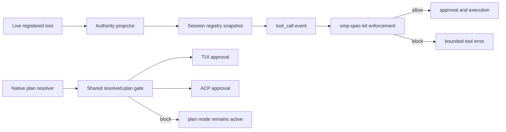

# OMP v18 authority and selected-plan ABI grounding — 2026-08-29

## Decision

Upgrade the active OMP binary and the repository compatibility baseline to v18.0.10, then implement the two missing host contracts on top of that release instead of leaving product work indefinitely deferred:

1. authenticated tool authority on pre-execution tool events;
2. a blocking event for the exact plan selected by the native resolver.

A version bump alone does not provide either contract. OMP v18.0.10 already retains the required MCP metadata internally, but drops it when constructing `tool_call`; its plan resolver already returns the selected plan content, but `PlanApprovalDetails` drops that content and no extension event is emitted.

## Grounded facts

| Fact | Evidence |
|---|---|
| Active binary is v18.0.3; v18.0.10 is available. | `omp --version`; `omp update --check` |
| Stable npm release is 18.0.10. | `npm view @oh-my-pi/pi-coding-agent version dist-tags --json` |
| v18.0.10 tag resolves to commit `33cc6b9a043a74e00a157e72ca909272796d8461`. | `https://api.github.com/repos/can1357/oh-my-pi/git/ref/tags/v18.0.10` |
| v18.0.10 extension `ToolCallEvent` contains only `toolCallId`, `toolName`, and `input`; no authority envelope. | `https://github.com/can1357/oh-my-pi/blob/v18.0.10/packages/coding-agent/src/extensibility/extensions/types.ts#L920-L978` |
| MCP tool objects already retain `mcpServerName`, `mcpToolName`, normalized parameters, and connection provider metadata. | `https://github.com/can1357/oh-my-pi/blob/v18.0.10/packages/coding-agent/src/mcp/tool-bridge.ts#L490-L555` |
| The model-loop event constructor forwards only name, call ID, and normalized input. | `https://github.com/can1357/oh-my-pi/blob/v18.0.10/packages/coding-agent/src/session/agent-session.ts#L3675-L3710` |
| Direct/nested dispatch has a second constructor with the same metadata loss. | `https://github.com/can1357/oh-my-pi/blob/v18.0.10/packages/coding-agent/src/extensibility/extensions/wrapper.ts#L170-L245` |
| Native plan resolution already returns `planFilePath`, `planContent`, and normalized title. | `https://github.com/can1357/oh-my-pi/blob/v18.0.10/packages/coding-agent/src/plan-mode/approved-plan.ts#L130-L205` |
| Interactive review drops plan content and returns only path/title/existence. | `https://github.com/can1357/oh-my-pi/blob/v18.0.10/packages/coding-agent/src/session/agent-session.ts#L1010-L1045` |
| ACP has a separate resolver/approval path and must share the same gate. | `https://github.com/can1357/oh-my-pi/blob/v18.0.10/packages/coding-agent/src/modes/acp/acp-agent.ts#L1870-L1920` |
| Pre-execution extension-handler error or timeout blocks by default. | `https://github.com/can1357/oh-my-pi/blob/v18.0.10/packages/coding-agent/src/extensibility/extensions/runner.ts#L1440-L1495` |

## Proposed host contracts

### Tool authority

Add one non-model-controlled envelope to `tool_call` and `tool_result`:

```ts
interface ToolAuthorityV1 {
  schema: "tool-call-authority-abi@1";
  providerKind: "builtin" | "extension" | "mcp" | "device";
  registeredToolName: string;
  serverId: string | null;
  sourceToolName: string;
  inputSchemaSha256: string;
  registrySnapshotSha256: string;
  sourcePath: string | null;
}
```

For MCP calls, construct it from the actual registered `MCPTool`/`DeferredMCPTool` object and manager source, never by parsing the model-visible name. Hash a canonical JSON projection of the actual registered input schema. Build the registry snapshot only after the live tool slate is finalized; every event references that immutable session snapshot.

### Selected plan

Add a blocking post-resolver event shared by TUI and ACP:

```ts
interface PlanApprovalRequestedEvent {
  type: "plan_approval_requested";
  requestId: string;
  sessionId: string;
  planFileUrl: string;
  planContent: string;
  planSha256: string;
  title: string;
  planMode: "tui" | "acp";
}

type PlanApprovalRequestedResult =
  | { block: true; reason: string }
  | { block?: false };
```

Emit it after `resolveApprovedPlan` chooses exact bytes and before any user/client approval UI. A block keeps plan mode active and surfaces the reason to the model/user. TUI and ACP must call one shared resolver-and-gate method so neither path can bypass the other.

## Architecture



## Failure modes

| Failure | Required behavior |
|---|---|
| Schema cannot be canonically serialized | Block authority-dependent activation; never hash an unstable representation. |
| Registry changes after snapshot | Rebuild under the registry mutation lock before accepting another call; mismatch is `UNKNOWN`, not trusted. |
| Deferred MCP connection lacks provider source | Authority envelope remains present with a non-authorizing provider state; authoring calls are blocked. |
| Direct/nested dispatch bypasses the agent loop | Extension wrapper constructs the same authority envelope from the same projector. |
| Plan content changes between resolution and approval | Hash mismatch blocks; approval displays/records the exact gated bytes. |
| Gate handler errors or times out | Preserve OMP's existing fail-closed behavior and bounded reason. |
| ACP and TUI produce different selected-plan contracts | Shared resolver-and-gate method is mandatory; duplicate implementations are rejected. |

## Rejected alternatives

| Alternative | Rejection |
|---|---|
| Treat `mcp__server__tool` spelling as authority | Name parsing is not origin authentication and ignores the already-available registered metadata. |
| Read `.mcp.json` inside the enforcement extension | Configuration describes intent, not the live tool object or session registry. |
| Keep `DEFERRED_HOST_ABI` as the roadmap endpoint | It records the gap but does not deliver the product; this work implements the missing ABI. |
| Re-scan `local://` files before plan approval | Duplicates native resolution and can gate different bytes. |
| Patch only interactive mode | ACP would remain an unguarded approval path. |
| Put the spec API behind LSP instead of MCP | Violates the single agent-facing MCP boundary and does not solve write authority. |

## Blocking probes

- **З-1:** prove one canonical schema serializer yields the same SHA-256 for built-in, extension, active MCP, and deferred MCP tools across two fresh sessions.
- **З-2:** prove registry snapshot creation occurs after all startup registration and under the same mutation lock used by later registry changes.
- **З-3:** prove provider/server/source-tool identity survives active connection, deferred connection, reconnect, and name-collision handling.
- **З-4:** prove model-loop, nested device, Cursor/direct, and retry dispatches emit exactly one equivalent authority envelope.
- **З-5:** prove TUI and ACP both invoke one post-resolver plan gate and preserve plan mode on block.
- **З-6:** prove event input revisions cannot alter the authority envelope or bypass the second approval check.

No non-blocking unknown affects the proposed architecture.

## Work order

1. Upgrade the local binary to v18.0.10 and recapture the unmodified v18 baseline.
2. Add authority types/projector/registry snapshot and thread them through every event constructor.
3. Add shared resolved-plan gating and migrate TUI plus ACP onto it.
4. Add upstream behavioral tests for authority parity, reconnects, nested/direct dispatch, TUI, ACP, timeout, and block behavior.
5. Build a pinned OMP candidate, run the omp-spec-kit probes against it, and submit the upstream change.
6. After an immutable upstream commit/release exists, update omp-spec-kit compatibility pins, fixtures, schemas, product states, and release evidence.

## Acceptance scenarios

- An `omp-spec-kit` authoring MCP call carries exact provider/server/source-tool/schema/snapshot identity and is accepted only when it matches the installed candidate registry.
- A same-name extension or another MCP server is rejected before filesystem mutation.
- A registry or schema change after startup becomes visible and cannot inherit prior authorization.
- The exact native-selected plan is blocked before TUI or ACP approval when corpus validation fails.
- A valid plan proceeds in both modes with the same content hash.
- Handler error/timeout remains fail-closed with a bounded reason.

## Rollback

- OMP authority ABI: revert the upstream commit; no omp-spec-kit code should depend on the envelope before the compatibility pin changes.
- Plan event: revert the shared resolver-and-gate commit; TUI/ACP return to their prior approval flow.
- omp-spec-kit activation: one product-state/config edit restores the prior read-only v0.3.2 profile; historical v17.3.7 receipts remain untouched.
